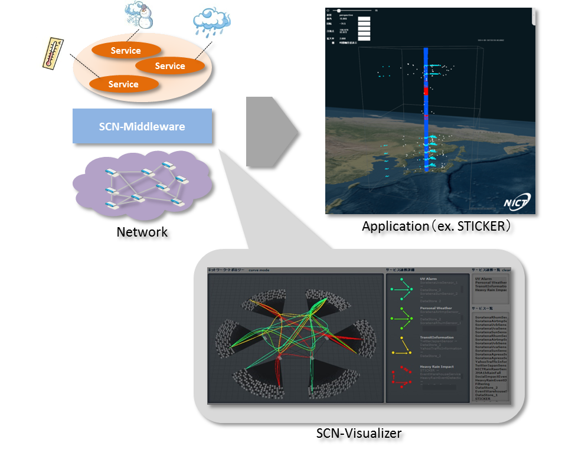
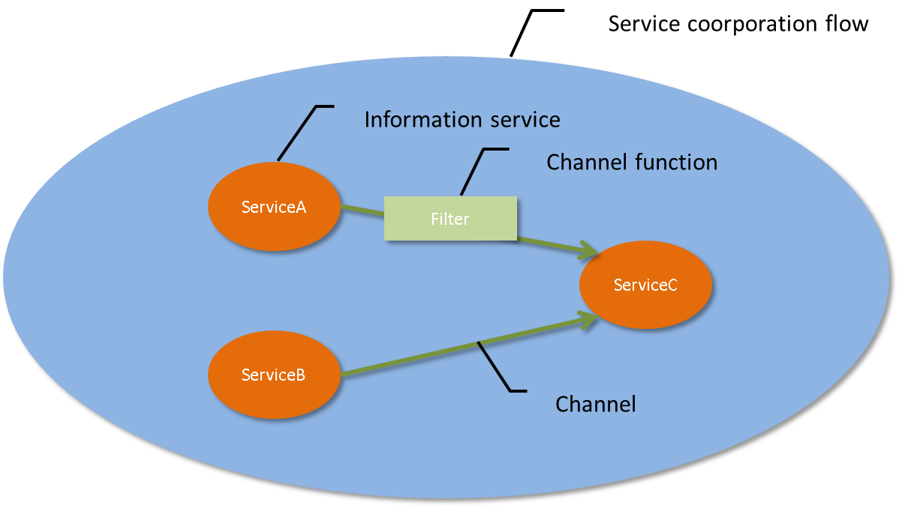
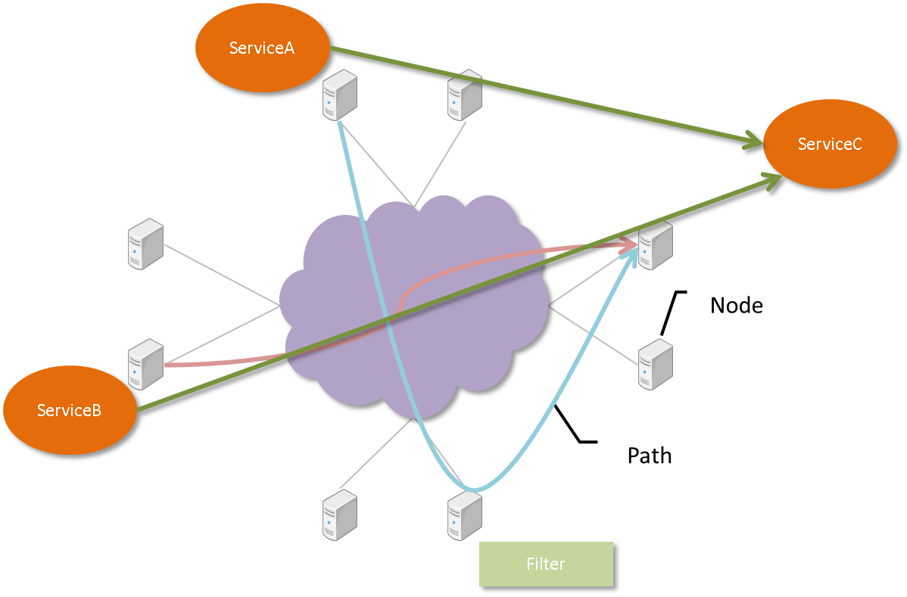
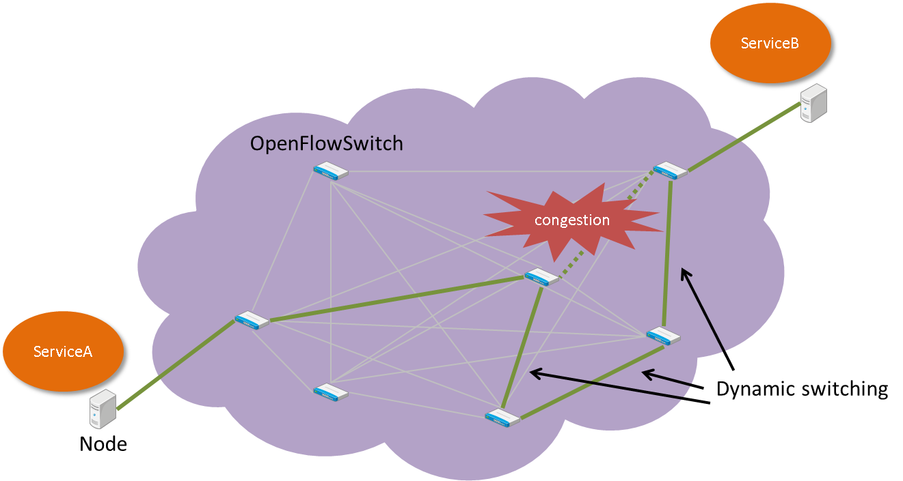

========
SCNとは
========
* SCN(Service-Controlled Networking)とは、アプリケーション要求に応じてネットワーク資源を自動構成し、アプリケーションを構成する様々な情報サービスを効率よく連携させることを可能とする技術です。
* これにより、様々な分野のセンサーデータやソーシャルデータを横断的に分析し、新たな価値を見出すサービスを動的に構成することができます。
* また、センサーデータにより突発的に生じたイベントを検出すると、その周辺の様々な情報を収集するセンサーデータを集中的に収集解析することができます。

SCNの特長
==========

サービス検索/サービス連携
--------------------------
* 各ノード上で分散稼働している情報サービスの中から、指定された検索条件にマッチする情報サービスを発見することができます。
* また、発見した情報サービスを連携させ、必要なデータを必要な量だけ収集することができます。

In-Network Data Processing
---------------------------
* 情報サービスを連携させ、データを収集する際に、ネットワーク上でフィルタリングや集約などの処理を実施することができます。
* Channel functionを実行する最適なノードを割り当て、そのノードを経由する経路をルーティングすることができます。

データ通信経路制御
-------------------
* ネットワーク上で輻輳が発生した場合、輻輳を回避するよう動的にデータの通信経路を切り替えることができます。

サービス検索/サービス連携の宣言的定義
--------------------------------------
* サービス検索およびサービス連携の情報を、以下のようなDSN(Declarative Service Networking)により宣言的に定義することができます。

::

    state do
        @jmarain: discovery(category=sensor, type=rain)
        @traffic: discovery(category=sensor, type=traffic)
        @store:   discovery(type=store, key=heavyrain)

        scratch: s_jmarain, @jmarain
        scratch: s_traffic, @traffic
        channel: c_store,   @store
    end

    bloom do
        c_store <~ s_jmarain.filter(rain >= 25 && range(latitude, 33.0, 37.0) && range(longitude, 134.0, 137.0)).meta(Table=JMA1hRainFall)

        event_heavyrain <+ c_store.trigger(30, count > 130)

        event_heavyrain.in do
            c_store <~ s_traffic.filter(not like(Condition, ".*平常運転.*").meta(Table=YahooTrafficInformation)
        end
    end

SCNの開発について
==================
SCNは、国立研究開発法人 情報通信研究機構 情報利活用基盤研究室(http://nict.go.jp/univ-com/isp/index.html)
によって開発されているオープンソースプロジェクトです。

