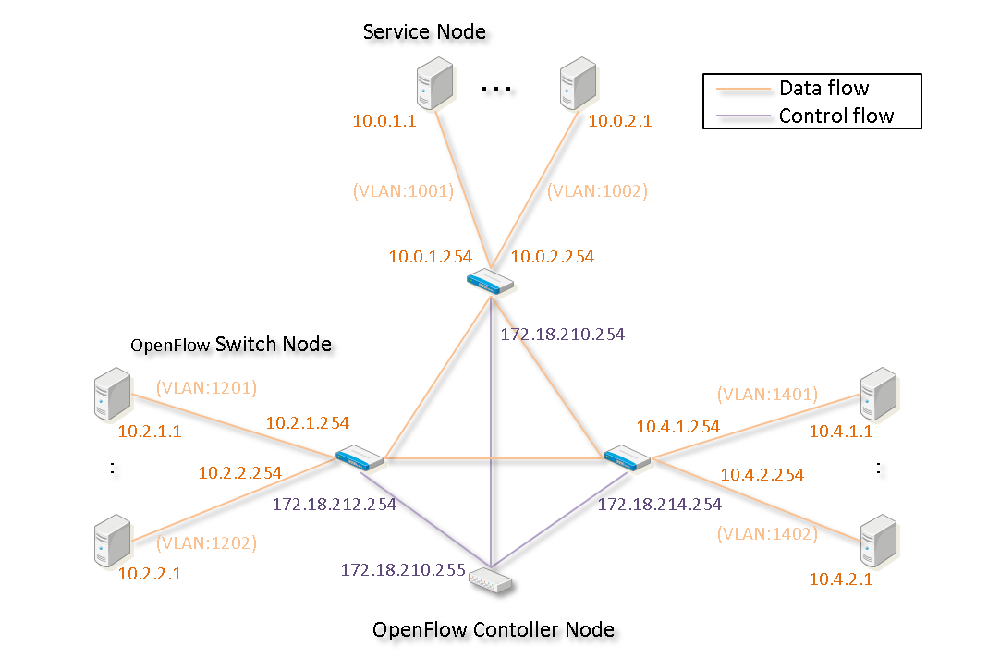

==============
SCNの環境設定
==============

トポロジー例
==============
以下に示したトポロジの例を基に、SCNの動作環境について説明します。

OpenFlowネットワークは、データパケットが流れるデータフローと、コントロールパケットが流れるコントロールフローの2つのネットワークによって構成されます。
データフローでは、通常のネットワークと同様に、サービスノード間で送受信するデータパケットが流れます。
コントロールフローでは、OpenFlowコントローラとOpenFlowスイッチ間で、OpneFlow特有のメッセージパケット（Flow-ModやPacket-Inなど）が流れます。

サービスノード
===============

ネットワークインタフェースの設定
---------------------------------
"10.0.1.1"のサービスノードの「/etc/network/interfaces」ファイルの設定を下記に示します。
各サービスノードについて、本ファイルの内容をそれぞれのIPアドレスに合わせて編集します。

::

    auto lo
    iface lo inet loopback

    auto eth1
    iface eth1 inet static
        address 10.0.1.1
        netmask 255.255.255.0
        network 10.0.1.0
        broadcast 10.0.1.255
        up route add -net 10.0.0.0 netmask 255.0.0.0 gw 10.0.1.254
        post-up ethtool -K $IFACE tso off gso off gro off

interfacesファイルの編集後、下記のコマンドを実行します。

::

    $ sudo /etc/init.d/networking restart

OpenFlowスイッチノード
=======================

Open vSwitchのインストール
---------------------------

下記のコマンドを実行します。

::

$ sudo apt-get install libssl1.0.0 autoconf automake libtool
$ cd
$ wget http://69.56.251.103/releases/openvswitch-2.1.2.tar.gz
$ tar zxf openvswitch-2.1.2.tar.gz
$ cd openvswitch-2.1.2
$./boot.sh
$./configure --with-linux=/lib/modules/`uname -r`/build
$ make
$ sudo make modules_install
$ sudo /sbin/modprobe openvswitch 
$ sudo echo "openvswitch" >>  /etc/modules
$ sudo mkdir -p /usr/local/etc/openvswitch /usr/local/var/run/openvswitch
$ sudo ./ovsdb/ovsdb-tool create /usr/local/etc/openvswitch/conf.db vswitchd/vswitch.ovsschema

ネットワークインタフェースの設定
---------------------------------
"172.18.210.254"のOpenFlowスイッチノードの「/etc/network/interfaces」ファイルの設定を下記に示します。
各OpenFlowスイッチについて、本ファイルの内容をそれぞれのIPアドレスに合わせて編集します。

::

    auto lo
    iface lo inet loopback
    
    auto eth0
    iface eth0 inet static
        address 172.18.210.254
        netmask 255.255.0.0
        network 172.18.0.0
        broadcast 172.18.255.255
        gateway 172.18.254.254
        post-up ethtool -K $IFACE tso off gso off gro off
    
    auto eth1
    iface eth1 inet manual
        pre-up ifconfig $IFACE up
        post-down ifconfig $IFACE down
        post-up ethtool -K $IFACE tso off gso off gro off
    
    auto eth1.1001
    iface eth1.1001 inet manual
        pre-up ifconfig $IFACE up
        pre-up ifconfig $IFACE hw ether 00:00:00:00:10:01
        post-down ifconfig $IFACE down
        post-up ethtool -K $IFACE tso off gso off gro off
    
    auto eth1.1002
    iface eth1.1002 inet manual
        pre-up ifconfig $IFACE up
        pre-up ifconfig $IFACE hw ether 00:00:00:00:10:02
        post-down ifconfig $IFACE down
        post-up ethtool -K $IFACE tso off gso off gro off
    
    auto eth2
    iface eth2 inet manual
        pre-up ifconfig $IFACE up
        post-down ifconfig $IFACE down
        post-up ethtool -K $IFACE tso off gso off gro off
    
    auto eth2.2751
    iface eth2.2751 inet manual
        pre-up ifconfig $IFACE up
        post-down ifconfig $IFACE down
        post-up ethtool -K $IFACE tso off gso off gro off
    
    auto eth2.2752
    iface eth2.2752 inet manual
        pre-up ifconfig $IFACE up
        post-down ifconfig $IFACE down
        post-up ethtool -K $IFACE tso off gso off gro off

IPv6無効化の設定
-----------------

各OpenFlowスイッチの「etc/sysctl.conf」ファイルに、下記の設定を追加します。

::

    net.ipv6.conf.all.disable_ipv6 = 1
    net.ipv6.conf.default.disable_ipv6 = 1

下記のコマンドを実行します。

::

    $ sudo reboot

OpenFlowコントローラノード
===========================

ネットワークインタフェースの設定
---------------------------------

OpenFlowコントローラノードの「/etc/network/interfaces」を下記のように編集します。

::

    auto lo
    iface lo inet loopback

    auto eth0
    iface eth0 inet static
            address 172.18.210.255
            netmask 255.255.0.0
            network 172.18.0.0
            broadcast 172.18.255.255
            gateway 172.18.254.254
            post-up ethtool -K $IFACE tso off gso off gro off

interfacesファイルの編集後、下記のコマンドを実行します。

::

    $ sudo /etc/init.d/networking restart

POX用設定ファイルの設定
------------------------

「pox_sample.ini」のトポロジー定義を下記のように設定します。

::

    [TOPOLOGY]
    SWITCHS=S1,S2,S3
    
    [S1]
    IP=172.18.210.254
    PORTS=S1E1.1001,S1E1.1002,S1E2.2751,S1E2.2752
    
    [S1E1.1001]
    NAME=eth1.1001
    IP=10.0.1.254
    
    [S1E1.1002]
    NAME=eth1.1002
    IP=10.0.2.254
    
    [S1E2.2751]
    NAME=eth2.2751
    SPEED=50M
    
    [S1E2.2752]
    NAME=eth2.2752
    SPEED=50M
    
    [S2]
    IP=172.18.212.254
    PORTS=S2E1.1201,S2E1.1202,S2E2.2751, S2E2.2753
    
    [S2E1.1201]
    NAME=eth1.1201
    IP=10.2.1.254
    
    [S2E1.1202]
    NAME=eth1.1202
    IP=10.2.2.254
    
    [S2E2.2751]
    NAME=eth2.2751
    SPEED=50M
    
    [S2E2.2753]
    NAME=eth2.2753
    SPEED=50M
    
    [S3]
    IP=172.18.214.254
    PORTS=S3E1.1401,S3E1.1402,S3E2.2752,S3E2.2753
    
    [S3E1.1401]
    NAME=eth1.1401
    IP=10.4.1.254
    
    [S3E1.1402]
    NAME=eth1.1402
    IP=10.4.2.254
    
    [S3E2.2752]
    NAME=eth2.2752
    SPEED=50M
    
    [S3E2.2753]
    NAME=eth2.2753
    SPEED=50M

