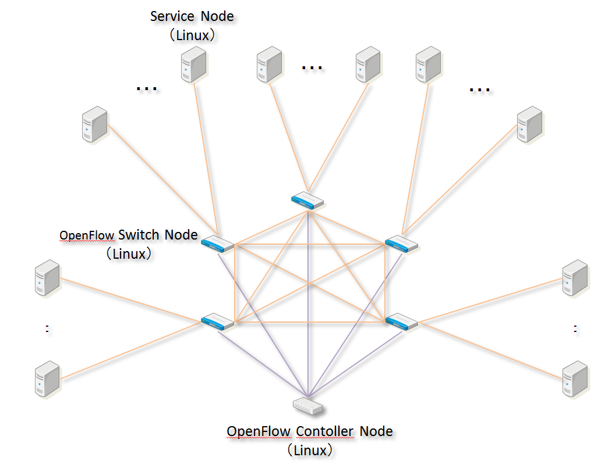
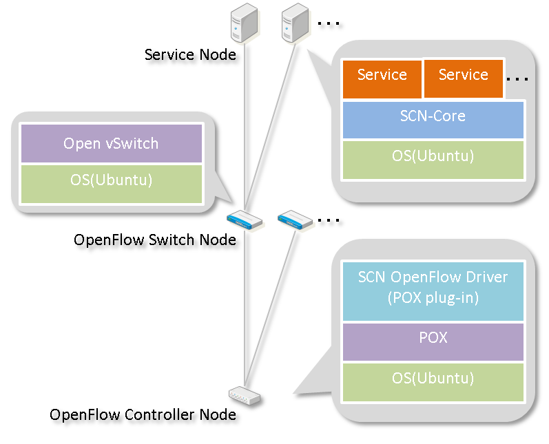
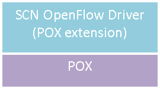

===============
Architecture
===============

.. _POX: http://www.noxrepo.org/pox/about-pox/

Network Structure
=================
* SCN OpenFlow Driver uses OpenFlow as a programmable network.
* Service node on which each information service is running is connected via the OpenFlow network.
* OpenFlow switch connects to OpenFlow controller. Each service node connects to one OpenFlow switch.
* SCN OpenFlow Driver sets the data transfer rule on the flow table of each OpenFlow switch by following the definition of service cooperation.
* SCN OpenFlow Driver switches a flow dynamically according to the load condition of the network, and avoids the concentration of traffic on a specific route.
  In this way, it optimizes the utilization of network resources.

Software structure
==================
* On the service node, the SCN Core runs; on that, multiple service programs that use SCN run.
* On the OpenFlow switch and OpenFlow controller, software called “Open vSwitch”and “POX” must be run to enable OpenFlow.
* SCN OpenFlow Driver runs as the POX plug-in on the OpenFlow controller.

Structure of SCN OpenFlow Driver
================================
* SCN OpenFlow Driver is implemented by expanding OpenFlow controller “ `POX`_ ”.

POX
^^^^
* Free OpenFlow controller.
* It provides the standard functions of OpenFlow controller
  (such as detection of OpenFlow switch, rewriting Flow table, receiving PacketIn, sending PacketOut, and acquiring statistical information from the OpenFlow switch).

SCN OpenFlow Driver
^^^^^^^^^^^^^^^^^^^^
* For SCN, it inherits a class that POX has or adds functions as the POX plug-in.
* Primarily, it runs as the following, event-driven.

  * OpenFlow switch connection
  * PacketIn
  * Receiving message from SCN Core
  * Timer, etc.

Function of SCN OpenFlow Driver
===============================

SCN Core communication function
^^^^^^^^^^^^^^^^^^^^^^^^^^^^^^^
* SCN OpenFlow Driver sends and receives the following messages with SCN Core.

=============== ==================================================================================================================================================
Message type    Message description
=============== ==================================================================================================================================================
INITIALIZE      Notification of initializing SCN Core. It contains the IP address and port of SCN Core.
CREATE_BI_PATH  Notification of path creation. It contains the IP address of the data transmission source and destination and bandwidth of the communication.
UPDATE_PATH     Notification of communication bandwidth update. It contains the communication bandwidth after the update.
DELETE_PATH     Notification of path deletion. It contains the path IP of the deleted path.
OPTIMIZE        Notification of performing optimization of communication route.
=============== ==================================================================================================================================================

* INITIALIZE notification from SCN Core to SCN OpenFlow Driver is communicated in UDP. Messages other than that are communicated in TCP.

Service Server Notification Function
^^^^^^^^^^^^^^^^^^^^^^^^^^^^^^^^^^^^
* One service server manages service information that runs on SCN.
  When SCN Core searches a service, it inquires to the server.
  SCN OpenFlow Driver sends back the IP address of the server in response to INITIALIZE message of SCN Core.

Path Control Function
^^^^^^^^^^^^^^^^^^^^^
* Based on “Data transmission source IP address,” “Data transmission destination IP address,” and “Communication bandwidth,” it calculates the route from the data transmission source node to data transmission destination node (Dijkstra’s method is used for the communication route).
  Furthermore, it sets a Flow table for the OpenFlow switch on the route.

Path Optimization Function
^^^^^^^^^^^^^^^^^^^^^^^^^^
* It acquires network statistical information periodically from OpenFlow switch, and performs optimization of the data communication route.
* The acquisition of network statistical information is done by a standard OpenFlow structure.
* The optimization calculates the communication route using Dijkstra’s method as same as the creation of path.
  Based on the calculation result, it sets the Flow table of the OpenFlow switch and resets the communication route.

Configuration
=============
* When running `POX`_ , the configuration information can be entered by specifying an ini file that includes the following description.

::

    [stats]
    MONITOR_FLOW_PERIOD=10
    UNIT_OF_VALUE="bit"

* For adding a newly developed plug-in, describe the file name (except suffix) of the added plug-in under the ini file.

::

    [PLUGINS]
    flowBw
    middleware
    jsonLogger
    bwFlowBalancing
    virtualNode
    stats

